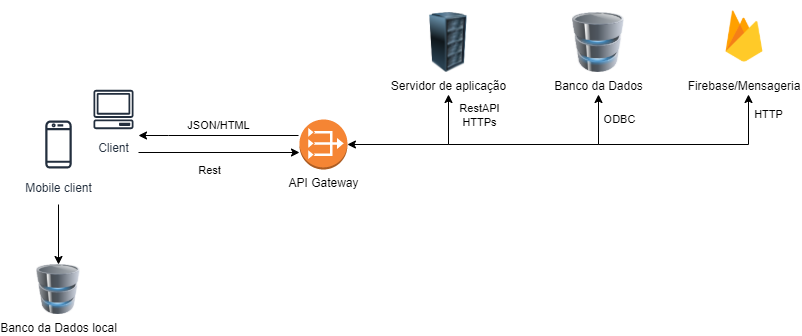
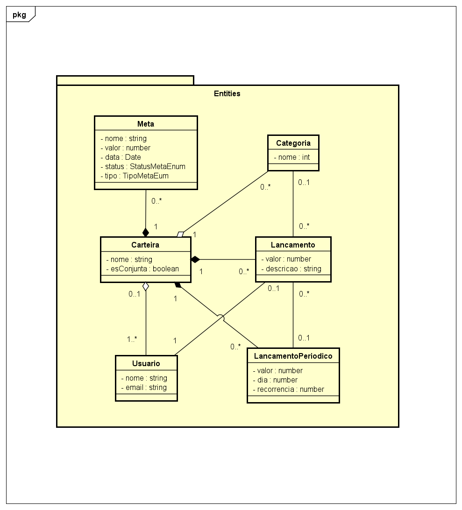
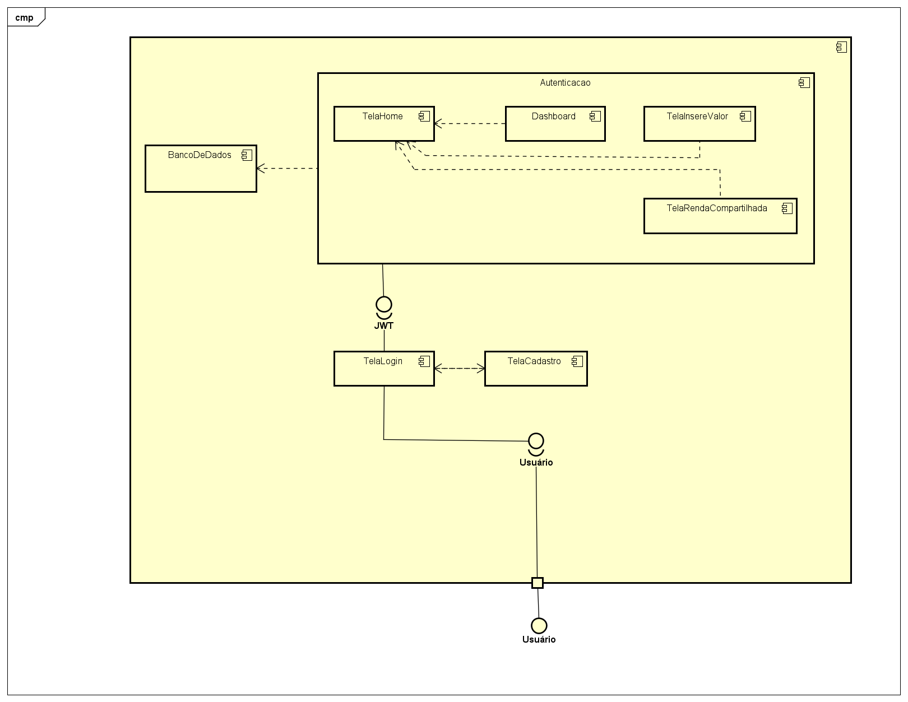

# DinDin

**Guilherme Gabriel Silva Pereira, ggspereira@sga.pucminas.br**

**Henrique Penna Forte Monteiro, henrique.forte@sga.pucminas.br**

**Lucas Ângelo Oliveira Martins Rocha, laomrocha@sga.pucminas.br**

**Victor Boaventura Góes Campos, vbgcampos@sga.pucminas.br**

**Vinícius Marini Costa e Oliveira, vinicius.marini@sga.pucminas.br**

---

Professores:

**Prof. Cleiton Silva Tavares**

**Prof. Pedro Alves De Oliveira**

---

_Curso de Engenharia de Software, Unidade Praça da Liberdade_

_Instituto de Informática e Ciências Exatas – Pontifícia Universidade de Minas Gerais (PUC MINAS), Belo Horizonte – MG – Brasil_

---

_**Resumo**. Para não perder o controle financeiro pessoal ou familiar, algumas estratégias ou ferramentas são necessárias para administrar as finanças, a plataforma DinDin foi desenvolvida como ferramenta para acabar ou mitigar a questão da perda de controle financeiro._

---

## Histórico de Revisões

| **Data** | **Autor** | **Descrição** | **Versão** |
| --- | --- | --- | --- |
| **[26/02/2022]** | [Guilherme Gabriel] | [Artefato 1 criado] | [1] |
| **[26/02/2022]** | [Henrique Penna] | [Artefato 2  criado] | [2] |
| **[26/02/2022]** | [Victor Boaventura] | [Artefato 3.1 criado] | [2] |
| **[26/02/2022]** | [Victor Boaventura] | [Artefatos 3.2 e 3.3 criado] | [2] |
| **[26/02/2022]** | [Lucas Ângelo] | [Artefatos 1, 2 e 3 em markdown] | [1] |
| | | | |
| | | | |

## SUMÁRIO

1. [Apresentação](#apresentacao "Apresentação")  
	1.1. Problema  
	1.2. Objetivos do trabalho  
	1.3. Definições e Abreviaturas  

2. [Requisitos](#requisitos "Requisitos")  
'	2.1. Requisitos Funcionais  
	2.2. Requisitos Não-Funcionais  
	2.3. Restrições Arquiteturais  
	2.4. Mecanismos Arquiteturais  

3. [Modelagem](#modelagem "Modelagem e projeto arquitetural")  
	3.1. Visão de Negócio  
	3.2. Visão Lógica  
	3.3. Modelo de dados (opcional)  

4. [Avaliação](#avaliacao "Avaliação da Arquitetura")  
	4.1. Cenários  
	4.2. Avaliação  

5. [Referências](#referencias "REFERÊNCIAS") 

6. [Apêndices](#apendices "APÊNDICES") 

# 1. Apresentação

A falta de controle de finanças é motivo de estresse em 58,4% das famílias brasileiras. Em um contexto de pandemia, esse problema tem se agravado consideravelmente. Nesse sentido, para não perder o controle financeiro pessoal ou familiar, é necessário alguma estratégia ou ferramenta para gerenciar finanças. Aliando o contexto tecnológico com o problema supracitado, a plataforma DinDin foi desenvolvida para fazer esse papel de ferramenta para acabar com ou atenuar o problema da perda de controle financeiro.

## 1.1. Problema

Os problemas financeiros estão presentes diariamente na vida dos brasileiros. Dívidas surgem todos os dias, sejam elas pequenas e repentinas como um lanche vespertino ou grandes e planejadas como uma conta de aluguel. Devido a isso, fica difícil manter o controle sobre quanto se tem, quanto se gastou, e quanto se pode gastar. Nesse contexto, a falta do gerenciamento do dinheiro causa endividamentos, estresse e ocasiona a não realização de sonhos e objetivos pessoais.

## 1.2. Objetivos do trabalho

O objetivo principal do trabalho é desenvolver uma aplicação distribuída de controle de finanças pessoais, que possibilite aos seus usuários uma forma mais prática de regularem seus custos.
Os objetivos específicos são:
- Permitir o usuário dividir suas despesas em categorias;
- Permitir o usuário lançar suas despesas e receitas diárias;
- Permitir o usuário, junto de outros usuários, lançar despesas e receitas de modo compartilhado.
- Permitir que o usuário controle de onde o dinheiro está saindo ou entrando.

## 1.3. Definições e Abreviaturas

_N/A_

# 2. Requisitos

## 2.1. Requisitos Funcionais

| **ID** | **Descrição** | **Prioridade** |
| --- | --- | --- |
| RF001 | O usuário deve poder realizar um cadastro de conta | Alta |
| RF002 | O usuário deve poder fazer CRUD de seus lançamentos (recorrentes ou não) | Alta |
| RF003 | O usuário deve poder cadastrar categorias para seus lançamentos | Média |
| RF004 | O usuário deve conseguir convidar outro usuário para uma conta conjunta de lançamentos | Média |
| RF005 | O usuário pode cadastrar quais bancos ele possui conta e o respectivo valor que possui nessas contas | Baixa |
| RF006 | O usuário pode selecionar qual o banco de origem de uma transação | Baixa |
| RF007 | O usuário deve possuir uma tela de gráficos para um visão geral de seus gastos | Média |
| RF018 | O usuário deve conseguir comunicar com a alexa sobre seus lançamentos | Baixa |
| RF009 | O usuário deve conseguir criar um objetivo financeiro | Média |
| RF010 | O usuário deve conseguir visualizar estatísticas informando médias entre despesas em dias, semanas ou meses, detalhando média diária e realizando comparações com outros períodos | Baixa |

## 2.2. Requisitos Não-Funcionais

| **ID** | **Descrição** |
| --- | --- |
| RNF001 | O sistema web deve ser responsivo para proporcionar o uso de todas as funcionalidades providas pelos requisitos funcionais para dispositivos móveis e web |
| RNF002 | O sistema deve ser aprovado nos testes unitários |
| RNF003 | O sistema deve possuir uma interface que seja objetiva para o usuário, com no máximo quatro funcionalidades por página |
| RNF004 | O sistema deve ser compatível com sistema operacional Linux, com o objetivo de proporcionar a disponibilidade em nuvem de pelo menos 98% do tempo de atividade (uptime) |
| RNF005 | O sistema deve ser dimensionado para suportar até 100 usuários conectados ao mesmo tempo com delay máximo de 3 segundos de carregamento |
| RNF006 | O sistema deve garantir a segurança das senhas dos usuários, criptografando-as em SHA256 ao serem inseridas no banco de dados |
| RNF007 | A aplicação deve estar disponível nos modos claro e escuro, possibilitando maior conforto para o usuário |

## 2.3. Restrições Arquiteturais

As restrições impostas ao projeto que afetam sua arquitetura são:
- A aplicação frontend deverá ser desenvolvida em VueJs com Vuetify;
- A aplicação mobile deverá ser desenvolvida com Flutter usando Sqlite;
- O sistema backend deverá utilizar NodeJS com ORM Sequelize;
- O aplicativo seguirá o padrão MVC;
- A comunicação da API deve seguir o padrão RESTful;
- O ambiente de desenvolvimento será no docker;
- O ambiente de produção estará na nuvem.

## 2.4. Mecanismos Arquiteturais

| **Análise** | **Design** | **Implementação** |
| --- | --- | --- |
| Persistência | Relacional/SQL | Sequelize |
| Front end | Em componentes | Flutter/Vuejs |
| Back end | Orientado à casos de uso | NodeJs |
| Integração | Api Rest / MVC | Github |
| Log do sistema | Log de erros | Nodejs |
| Teste de Software | Orientado a casos de uso | Jest |
| Deploy | Pipeline | AWS |

# 3. Modelagem e projeto arquitetural

**Figura 1 - Visão Geral da Solução**

## 3.1. Visão de Negócio (Funcionalidades)

1. O sistema deve controlar todo e qualquer tipo de renda (contas bancárias, salário, rendas informais, comércio, etc).
2. O sistema deve controlar todo e qualquer tipo de despesas e receitas (parceladas, fixas e variáveis).
3. O sistema deve permitir uma categorização e subcategorização de receitas e despesas para organizar bem as finanças e ter consciência com o quê está gastando e ganhando mais.
4. O sistema deve fornecer multicategorias para despesas: Informe as divisões para uma despesa.
5. O sistema deve fornecer diversos gráficos para exibição de evolução de despesas e/ou receitas em forma de gráficos de linhas, barras ou pizza.
7. O sistema deve permitir exportação de dados para Excel, PDF, CSV e HTML.
8. O sistema deve fornecer um calendário disponível para que seja possível ver no mês inteiro como estão distribuídas suas finanças no mês.
9. O sistema deve possuir uma integração com a Alexa para que o usuário registre sua despesa/receita comunicando com a Alexa.
10. O sistema deve fornecer estatísticas informando médias entre despesas em dias, semanas ou meses, detalhando média diária e realizando comparações com outros períodos para fornecer um pleno conhecimento sobre como o usuário está economizando em relação aos seus hábitos passados.
11. O sistema deve possuir um filtro do histórico de receitas e despesas por conta, categorias e subcategorias.

### Descrição resumida dos Casos de Uso / Histórias de Usuário

Casos de uso:
#### UC01 – Lançar Receitas

| **Descrição** | Eu como usuário quero lançar minhas receitas pessoais |
| --- | --- |
| **Atores** | Usuário |
| **Prioridade** | Alta |
| **Requisitos associados** | RF001 |
| **Fluxo Principal** | Entrar no aplicativo e cadastrar uma receita. |

#### UC02 – Lançar Despesas

| **Descrição** | Eu como usuário quero lançar minhas despesas pessoais |
| --- | --- |
| **Atores** | Usuário |
| **Prioridade** | Alta |
| **Requisitos associados** | RF001 |
| **Fluxo Principal** | Entrar no aplicativo e cadastrar uma despesa |

#### UC03 – Criar Conta Conjunta

| **Descrição** | Eu como usuário quero criar uma conta conjunta |
| --- | --- |
| **Atores** | Usuário |
| **Prioridade** | Média |
| **Requisitos associados** | RF004 |
| **Fluxo Principal** | Entrar no aplicativo e cadastrar uma conta conjunta e adicionar outros usuários |

#### UC04 – Categorizar Despesa

| **Descrição** | Eu como usuário quero categorizar minhas despesas |
| --- | --- |
| **Atores** | Usuário |
| **Prioridade** | Alta |
| **Requisitos associados** | RF005 |
| **Fluxo Principal** | Entrar no aplicativo, criar uma categoria e categorizar uma ou mais despesa |

#### UC05 – Categorizar Receita

| **Descrição** | Eu como usuário quero categorizar minhas receitas |
| --- | --- |
| **Atores** | Usuário |
| **Prioridade** | Alta |
| **Requisitos associados** | RF006 |
| **Fluxo Principal** | Entrar no aplicativo, criar uma categoria e categorizar uma ou mais receita |

#### UC06 – Cadastrar Banco

| **Descrição** | Eu como usuário quero cadastrar banco |
| --- | --- |
| **Atores** | Usuário |
| **Prioridade** | Média |
| **Requisitos associados** | RF007 e RF008 |
| **Fluxo Principal** | Entrar no aplicativo cadastrar no banco |

#### UC07 – Acessar relatório

| **Descrição** | Eu como usuário quero acessar relatórios |
| --- | --- |
| **Atores** | Usuário |
| **Prioridade** | Média |
| **Requisitos associados** | RF009 e  RF012 |
| **Fluxo Principal** | Entrar no aplicativo e acessar os relatórios |

#### UC08 – Inserir lançamento via Alexa

| **Descrição** | Eu como usuário quero inserir lançamentos via Alexa |
| --- | --- |
| **Atores** | Usuário |
| **Prioridade** | Baixa |
| **Requisitos associados** | RF010 |
| **Fluxo Principal** | Entrar no aplicativo e conversar com a alexa |

#### UC09 – Criar objetivo financeiro

| **Descrição** | Eu como usuário quero criar um objetivo financeiro |
| --- | --- |
| **Atores** | Usuário |
| **Prioridade** | Baixa |
| **Requisitos associados** | RF011 |
| **Fluxo Principal** | Entrar no aplicativo e cadastrar um objetivo financeiro |

#### UC10 – Consultar extrato

| **Descrição** | Eu como usuário quero consultar extrato |
| --- | --- |
| **Atores** | Usuário |
| **Prioridade** | Média |
| **Requisitos associados** | RF009 |
| **Fluxo Principal** | Entrar no aplicativo e consultar o extrato |

Histórias de Usuário:

- Como usuário eu quero lançar minhas receitas pessoais para ter controle sobre meus ganhos.

- Como usuário eu quero lançar minhas despesas pessoais para ter controle sobre meus gastos.

- Como usuário eu quero criar uma conta conjunta para gerenciar lançamentos meus e dos meus familiares.

- Como usuário eu quero categorizar minhas despesas para saber em qual categoria é responsável pelos maiores gastos. 

- Como usuário eu quero categorizar minhas receitas para saber em qual categoria é responsável pelos maiores ganhos. 

- Como usuário eu quero conseguir cadastrar meus bancos para poder gerenciar qual é meu capital em cada um deles.

- Como usuário eu quero acessar relatórios para ver gráficos e estatísticas de médias entre despesas e receitas em dias, semanas ou meses, e realizar comparações com outros períodos para fornecer um pleno conhecimento sobre como está  a economia em relação ao passado.

- Como usuário eu quero inserir lançamentos via comandos de voz da Alexa para uma maior comodidade em usar o aplicativo para gerenciar meu capital.

- Como usuário eu quero criar um objetivo financeiro para poder acompanhar como estão minhas metas pessoas de ganho, econômica ou despesa.

- Como usuário eu quero poder consultar extratos no aplicativo ou gerar para poder verificar meus lançamentos e exportar para outras pessoas caso necessário.

## 3.2. Visão Lógica

### Diagrama de Classes

**Figura 2 – Diagrama de classes. Fonte: o próprio autor.**

Obs: Acrescente uma breve descrição sobre o diagrama apresentado na Figura 3.

### Diagrama de componentes

**Figura 3 – Diagrama de Componentes. Fonte: o próprio autor.**

- **Componente Geral** - Componente onde se encontram os outros componentes, o sistema de maneira geral.
- **Componente TelaLogin** - Tela onde o usuário realiza o login.
- **Componente TelaCadastro** - Tela onde o usuário realiza o cadastro na aplicação.
- **Componente Autenticação** - Para acessar o sistema o usuário deve ser autenticado para garantir a segurança.
- **Componente TelaHome** - Tela principal do sistema, onde o usuário acessa as outras funcionalidades.
- **Componente Dashboard** - Tela onde o usuário vê seu extrato de maneira gráfica categorizada.
- **Componente TelaInsereValor** - Tela onde o usuário cadastra seus gastos e receitas.
- **Componente TelaRendaCompartilhada** - Tela onde o usuário consegue compartilhar.
- **Componente BancoDeDados** - Banco de dados do sistema.

## 3.3. Modelo de dados (opcional)

_Caso julgue necessário para explicar a arquitetura, apresente o diagrama de classes ou diagrama de Entidade/Relacionamentos ou tabelas do banco de dados. Este modelo pode ser essencial caso a arquitetura utilize uma solução de banco de dados distribuídos ou um banco NoSQL._

 ")

**Figura 4 – Diagrama de Entidade Relacionamento (ER) - exemplo. Fonte: o próprio autor.**

Obs: Acrescente uma breve descrição sobre o diagrama apresentado na Figura 3.

# 4. Avaliação da Arquitetura

_Esta seção descreve a avaliação da arquitetura apresentada, baseada no método ATAM._

## 4.1. Cenários

_Apresente os cenários de testes utilizados na realização dos testes da sua aplicação. Escolha cenários de testes que demonstrem os requisitos não funcionais sendo satisfeitos. Os requisitos a seguir são apenas exemplos de possíveis requisitos, devendo ser revistos, adequados a cada projeto e complementados de forma a terem uma especificação completa e auto-explicativa._

**Cenário 1 - Acessibilidade:** Suspendisse consequat consectetur velit. Sed sem risus, dictum dictum facilisis vitae, commodo quis leo. Vivamus nulla sem, cursus a mollis quis, interdum at nulla. Nullam dictum congue mauris. Praesent nec nisi hendrerit, ullamcorper tortor non, rutrum sem. In non lectus tortor. Nulla vel tincidunt eros.

**Cenário 2 - Interoperabilidade:** Pellentesque habitant morbi tristique senectus et netus et malesuada fames ac turpis egestas. Fusce ut accumsan erat. Pellentesque in enim tempus, iaculis sem in, semper arcu.

**Cenário 3 - Manutenibilidade:** Phasellus magna tellus, consectetur quis scelerisque eget, ultricies eu ligula. Sed rhoncus fermentum nisi, a ullamcorper leo fringilla id. Nulla lacinia sem vel magna ornare, non tincidunt ipsum rhoncus. Nam euismod semper ante id tristique. Mauris vel elit augue.

**Cenário 4 - Segurança:** Suspendisse consectetur porta tortor non convallis. Sed lobortis erat sed dignissim dignissim. Nunc eleifend elit et aliquet imperdiet. Ut eu quam at lacus tincidunt fringilla eget maximus metus. Praesent finibus, sapien eget molestie porta, neque turpis congue risus, vel porttitor sapien tortor ac nulla. Aliquam erat volutpat.

## 4.2. Avaliação

_Apresente as medidas registradas na coleta de dados. O que não for possível quantificar apresente uma justificativa baseada em evidências qualitativas que suportam o atendimento do requisito não-funcional. Apresente uma avaliação geral da arquitetura indicando os pontos fortes e as limitações da arquitetura proposta._

| **Atributo de Qualidade:** | Segurança |
| --- | --- |
| **Requisito de Qualidade** | Acesso aos recursos restritos deve ser controlado |
| **Preocupação:** | Os acessos de usuários devem ser controlados de forma que cada um tenha acesso apenas aos recursos condizentes as suas credenciais. |
| **Cenários(s):** | Cenário 4 |
| **Ambiente:** | Sistema em operação normal |
| **Estímulo:** | Acesso do administrador do sistema as funcionalidades de cadastro de novos produtos e exclusão de produtos. |
| **Mecanismo:** | O servidor de aplicação (Rails) gera um _token_ de acesso para o usuário que se autentica no sistema. Este _token_ é transferido para a camada de visualização (Angular) após a autenticação e o tratamento visual das funcionalidades podem ser tratados neste nível. |
| **Medida de Resposta:** | As áreas restritas do sistema devem ser disponibilizadas apenas quando há o acesso de usuários credenciados. |

**Considerações sobre a arquitetura:**

| **Riscos:** | Não existe |
| --- | --- |
| **Pontos de Sensibilidade:** | Não existe |
| _ **Tradeoff** _ **:** | Não existe |

Evidências dos testes realizados

_Apresente imagens, descreva os testes de tal forma que se comprove a realização da avaliação._

# 5. REFERÊNCIAS

_Como um projeto da arquitetura de uma aplicação não requer revisão bibliográfica, a inclusão das referências não é obrigatória. No entanto, caso você deseje incluir referências relacionadas às tecnologias, padrões, ou metodologias que serão usadas no seu trabalho, relacione-as de acordo com a ABNT._

Verifique no link abaixo como devem ser as referências no padrão ABNT:

http://www.pucminas.br/imagedb/documento/DOC\_DSC\_NOME\_ARQUI20160217102425.pdf

**[1]** - _ELMASRI, Ramez; NAVATHE, Sham. **Sistemas de banco de dados**. 7. ed. São Paulo: Pearson, c2019. E-book. ISBN 9788543025001._

**[2]** - _COPPIN, Ben. **Inteligência artificial**. Rio de Janeiro, RJ: LTC, c2010. E-book. ISBN 978-85-216-2936-8._

**[3]** - _CORMEN, Thomas H. et al. **Algoritmos: teoria e prática**. Rio de Janeiro, RJ: Elsevier, Campus, c2012. xvi, 926 p. ISBN 9788535236996._

**[4]** - _SUTHERLAND, Jeffrey Victor. **Scrum: a arte de fazer o dobro do trabalho na metade do tempo**. 2. ed. rev. São Paulo, SP: Leya, 2016. 236, [4] p. ISBN 9788544104514._

**[5]** - _RUSSELL, Stuart J.; NORVIG, Peter. **Inteligência artificial**. Rio de Janeiro: Elsevier, c2013. xxi, 988 p. ISBN 9788535237016._

# 6. APÊNDICES

_Inclua o URL do repositório (Github, Bitbucket, etc) onde você armazenou o código da sua prova de conceito/protótipo arquitetural da aplicação como anexos. A inclusão da URL desse repositório de código servirá como base para garantir a autenticidade dos trabalhos._
