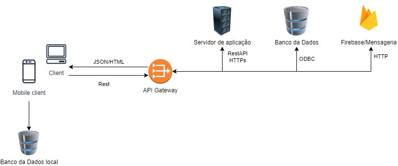
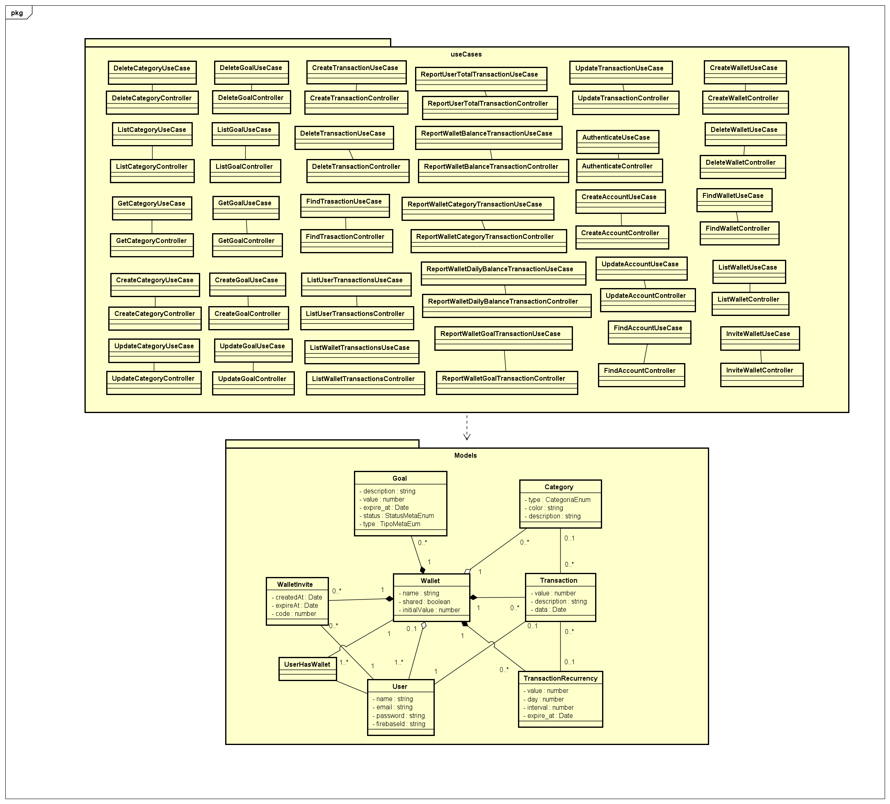

# DinDin

**Guilherme Gabriel Silva Pereira, ggspereira@sga.pucminas.br**

**Henrique Penna Forte Monteiro, henrique.forte@sga.pucminas.br**

**Lucas Ângelo Oliveira Martins Rocha, laomrocha@sga.pucminas.br**

**Victor Boaventura Góes Campos, vbgcampos@sga.pucminas.br**

**Vinícius Marini Costa e Oliveira, vinicius.marini@sga.pucminas.br**

---

Professores:

**Prof. Cleiton Silva Tavares**

**Prof. Pedro Alves De Oliveira**

---

_Curso de Engenharia de Software, Unidade Praça da Liberdade_

_Instituto de Informática e Ciências Exatas – Pontifícia Universidade de Minas Gerais (PUC MINAS), Belo Horizonte – MG – Brasil_

---

_**Resumo**. Para não perder o controle financeiro pessoal ou familiar, algumas estratégias ou ferramentas são necessárias para administrar as finanças, a plataforma DinDin foi desenvolvida como ferramenta para acabar ou mitigar a questão da perda de controle financeiro._

---

## Histórico de Revisões

| **Data** | **Autor** | **Descrição** | **Versão** |
| --- | --- | --- | --- |
| **[26/02/2022]** | [Guilherme Gabriel] | [Artefato 1 criado] | [1] |
| **[26/02/2022]** | [Henrique Penna] | [Artefato 2  criado] | [2] |
| **[26/02/2022]** | [Victor Boaventura] | [Artefatos 3.1 e 3.2 criado] | [3] |
| **[26/02/2022]** | [Victor Boaventura] | [Artefatos 3.3 e 3.4 criado] | [4] |
| **[26/02/2022]** | [Lucas Ângelo] | [Artefatos 1, 2 e 3 em markdown] | [4.1] |
| **[03/03/2022]** | [Guilherme Gabriel] | [Descrição Artefato 3.2] | [5] |
| | | | |

## SUMÁRIO

1. [Apresentação](#apresentacao "Apresentação")  
	1.1. Problema  
	1.2. Objetivos do trabalho  
	1.3. Definições e Abreviaturas  

2. [Requisitos](#requisitos "Requisitos")  
'	2.1. Requisitos Funcionais  
	2.2. Requisitos Não-Funcionais  
	2.3. Restrições Arquiteturais  
	2.4. Mecanismos Arquiteturais  

3. [Modelagem](#modelagem "Modelagem e projeto arquitetural")  
	3.1. Visão de Negócio  
	3.2. Visão Lógica  
	3.3. Modelo de dados (opcional)  

4. [Avaliação](#avaliacao "Avaliação da Arquitetura")  
	4.1. Cenários  
	4.2. Avaliação  

5. [Referências](#referencias "REFERÊNCIAS") 

6. [Apêndices](#apendices "APÊNDICES") 

# 1. Apresentação

A falta de controle de finanças é motivo de estresse em 58,4% das famílias brasileiras[1]. Em um contexto de pandemia, esse problema tem se agravado consideravelmente. Nesse sentido, para não perder o controle financeiro pessoal ou familiar, é necessário alguma estratégia ou ferramenta para gerenciar finanças. Aliando o contexto tecnológico com o problema supracitado, a plataforma DinDin foi desenvolvida para fazer esse papel de ferramenta para acabar com ou atenuar o problema da perda de controle financeiro.

## 1.1. Problema

Os problemas financeiros estão presentes diariamente na vida dos brasileiros. Dívidas surgem todos os dias, sejam elas pequenas e repentinas como um lanche vespertino ou grandes e planejadas como uma conta de aluguel. Devido a isso, fica difícil manter o controle sobre quanto se tem, quanto se gastou, e quanto se pode gastar. Nesse contexto, a falta do gerenciamento do dinheiro causa endividamentos, estresse e ocasiona a não realização de sonhos e objetivos pessoais.

## 1.2. Objetivos do trabalho

Desenvolver uma aplicação distribuída de controle de finanças pessoais, que possibilite aos seus usuários uma forma mais prática de controlar suas despesas e receitas.   
Os objetivos específicos são:
- Permitir ao usuário dividir suas despesas em categorias;
- Permitir ao usuário lançar suas despesas e receitas diárias;
- Permitir ao usuário, junto de outros usuários, lançar despesas e receitas de modo compartilhado.
- Permitir que o usuário controle de onde o dinheiro está saindo ou entrando.

## 1.3. Definições e Abreviaturas

RF: Requisito Funcional

RNF: Requisito não funcional

UC: Use Case (Caso de Uso)

# 2. Requisitos

## 2.1. Requisitos Funcionais

| **ID** | **Descrição** | **Prioridade** |
| --- | --- | --- |
| RF001 | O usuário deve poder realizar um cadastro de carteira | Alta |
| RF002 | O usuário deve poder fazer CRUD de suas transações (recorrentes ou não) | Alta |
| RF003 | O usuário deve poder cadastrar categorias para suas transações | Média |
| RF004 | O usuário deve conseguir convidar outro usuário para uma carteira conjunta de transações | Média |
| RF005 | O usuário pode cadastrar uma carteira para os bancos ele possui conta e o respectivo valor que possui nessas contas | Baixa |
| RF006 | O usuário pode selecionar qual a carteira de origem de uma transação | Baixa |
| RF007 | O usuário deve possuir uma tela de gráficos para um visão geral de seus gastos | Média |
| RF008 | O usuário deve conseguir criar um objetivo financeiro | Média |

## 2.2. Requisitos Não-Funcionais

| **ID** | **Descrição** |
| --- | --- |
| RNF001 | O sistema web deve ser responsivo para proporcionar o uso de todas as funcionalidades providas pelos requisitos funcionais para dispositivos móveis e web |
| RNF002 | O sistema deve ser aprovado nos testes unitários |
| RNF003 | O sistema deve possuir uma interface que seja objetiva para o usuário, com no máximo quatro funcionalidades por página |
| RNF004 | O sistema deve ser compatível com sistema operacional Linux, com o objetivo de proporcionar a disponibilidade em nuvem de pelo menos 98% do tempo de atividade (uptime) |
| RNF005 | O sistema deve ser dimensionado para suportar até 100 usuários conectados ao mesmo tempo com delay máximo de 3 segundos de carregamento |
| RNF006 | O sistema deve garantir a segurança das senhas dos usuários, criptografando-as em SHA256 ao serem inseridas no banco de dados |
| RNF007 | A aplicação móvel deve estar disponível nos modos claro e escuro, possibilitando maior conforto para o usuário |

## 2.3. Restrições Arquiteturais

As restrições impostas ao projeto que afetam sua arquitetura são:
- A aplicação frontend deverá ser desenvolvida em VueJs com Vuetify;
- A aplicação mobile deverá ser desenvolvida com Flutter usando Sqlite;
- O sistema backend deverá utilizar NodeJS com ORM Sequelize;
- O aplicativo seguirá o padrão MVC com arquitetura guiada a caso de uso;
- A comunicação da API deve seguir o padrão RESTful;
- O ambiente de desenvolvimento será no docker;
- O ambiente de produção estará na nuvem.

## 2.4. Mecanismos Arquiteturais

| **Análise** | **Design** | **Implementação** |
| --- | --- | --- |
| Persistência | Relacional/SQL | Sequelize |
| Front end | Em componentes | Flutter/Vuejs |
| Back end | Orientado à casos de uso | NodeJs |
| Integração | Api Rest / MVC | Github |
| Log do sistema | Log de erros | Nodejs |
| Teste de Software | Orientado a casos de uso | Jest |
| Deploy | Pipeline | AWS |

# 3. Modelagem e projeto arquitetural

**Figura 1 - Visão Geral da Solução**

O usuário web, vai enviar uma requisição HTTP com conteúdo JSON e ao receber o retorno também em JSON o framework responsivo vai representar via manipulaçao do HTML.   
O usuário mobile vai utilizar a API REST para executar os comandos e o framework Flutter vai realizar a apresentação visual no aparelho.   
O Firebase foi escolhido como serviço de mensageria pois o serviço de FCM (Firebase Cloud Messaging), encaixa no orçamento do projeto universitário, e possui uma forte integração com o aplicativo android.   
O "API Gateway" é uma representação do redirecionamento por DNS para cada serviço da nossa aplicação    
O banco local que estará presente na aplicação mobile será utilizado para caso usuário não possua conexão com a internet, os dados fiquem salvos até haja sincronizaçao com a nuvem.

## 3.1. Visão de Negócio (Funcionalidades)

1. O sistema deve controlar todo e qualquer tipo de renda (contas bancárias, salário, rendas informais, comércio, etc).
2. O sistema deve controlar todo e qualquer tipo de despesas e receitas (parceladas, fixas e variáveis).
3. O sistema deve permitir uma categorização de receitas e despesas para organizar bem as finanças e ter consciência com o quê está gastando e ganhando mais.
4. O sistema deve fornecer categorias para transações.
5. O sistema deve fornecer diversos gráficos para exibição de evolução de despesas e/ou receitas em forma de gráficos de linhas, barras ou setores.
6. O sistema deve possuir um filtro do histórico de receitas e despesas por carteira e categorias.

### Descrição resumida dos Casos de Uso / Histórias de Usuário

Casos de uso:
#### UC01 – Lançar Receitas

| **Descrição** | Eu como usuário quero lançar minhas receitas pessoais |
| --- | --- |
| **Atores** | Usuário |
| **Prioridade** | Alta |
| **Requisitos associados** | RF001 |
| **Fluxo Principal** | Entrar no aplicativo e cadastrar uma receita. |

#### UC02 – Lançar Despesas

| **Descrição** | Eu como usuário quero lançar minhas despesas pessoais |
| --- | --- |
| **Atores** | Usuário |
| **Prioridade** | Alta |
| **Requisitos associados** | RF001 |
| **Fluxo Principal** | Entrar no aplicativo e cadastrar uma despesa |

#### UC03 – Criar carteira Conjunta

| **Descrição** | Eu como usuário quero criar uma carteira conjunta |
| --- | --- |
| **Atores** | Usuário |
| **Prioridade** | Média |
| **Requisitos associados** | RF004 |
| **Fluxo Principal** | Entrar no aplicativo e cadastrar uma carteira conjunta e adicionar outros usuários |

#### UC04 – Categorizar Despesa

| **Descrição** | Eu como usuário quero categorizar minhas despesas |
| --- | --- |
| **Atores** | Usuário |
| **Prioridade** | Alta |
| **Requisitos associados** | RF005 |
| **Fluxo Principal** | Entrar no aplicativo, criar uma categoria e categorizar uma ou mais despesa |

#### UC05 – Categorizar Receita

| **Descrição** | Eu como usuário quero categorizar minhas receitas |
| --- | --- |
| **Atores** | Usuário |
| **Prioridade** | Alta |
| **Requisitos associados** | RF006 |
| **Fluxo Principal** | Entrar no aplicativo, criar uma categoria e categorizar uma ou mais receita |

#### UC06 – Cadastrar Carteira do Banco

| **Descrição** | Eu como usuário quero criar uma carteira para o meu banco |
| --- | --- |
| **Atores** | Usuário |
| **Prioridade** | Média |
| **Requisitos associados** | RF007 e RF008 |
| **Fluxo Principal** | Entrar no aplicativo criar a carteira |

#### UC07 – Acessar relatório

| **Descrição** | Eu como usuário quero acessar relatórios |
| --- | --- |
| **Atores** | Usuário |
| **Prioridade** | Média |
| **Requisitos associados** | RF009 e  RF012 |
| **Fluxo Principal** | Entrar no aplicativo e acessar os relatórios |

#### UC08 – Criar objetivo financeiro

| **Descrição** | Eu como usuário quero criar um objetivo financeiro |
| --- | --- |
| **Atores** | Usuário |
| **Prioridade** | Baixa |
| **Requisitos associados** | RF011 |
| **Fluxo Principal** | Entrar no aplicativo e cadastrar um objetivo financeiro |

Histórias de Usuário:

- Como usuário eu quero lançar minhas receitas pessoais para ter controle sobre meus ganhos.

- Como usuário eu quero lançar minhas despesas pessoais para ter controle sobre meus gastos.

- Como usuário eu quero criar uma carteira conjunta para gerenciar minhas transações e dos meus familiares.

- Como usuário eu quero categorizar minhas despesas para saber em qual categoria é responsável pelos maiores gastos. 

- Como usuário eu quero categorizar minhas receitas para saber em qual categoria é responsável pelos maiores ganhos. 

- Como usuário eu quero conseguir cadastrar as carteiras dos meus bancos para poder gerenciar qual é meu capital em cada um deles.

- Como usuário eu quero acessar relatórios para ver gráficos e estatísticas de médias entre despesas e receitas em dias, semanas ou meses, e realizar comparações com outros períodos para fornecer um pleno conhecimento sobre como está  a economia em relação ao passado.

- Como usuário eu quero criar um objetivo financeiro para poder acompanhar como estão minhas metas pessoas de ganho, econômica ou despesa.

## 3.2. Visão Lógica

### Diagrama de Classes

**Figura 2 – Diagrama de classes. Fonte: o próprio autor.**

Entities:
- User: cliente do sistema, representa a instância de um usuário do aplicativo.
- Wallet: Agrupamento de transações, usuários e metas. Pode ser conjunta (possuir mais de um usuário).
- WalletIvite: Convite de um usuário para participar de uma carteira.
- Transaction: transações monetários de gastos ou receitas, viculado a uma carteira.
- Category: Categoria de um transação. É vinculado a carteira, para poder ser atribuído à qualquer transação desta carteira.
- TransactionRecurency: Registro de um lancamento mensal, que se efetua e gera um lancamento quando atinge o dia registrado.
- Goal: Objetivo de economia em um determinado período de uma carteira.

UseCases: Cada caso de uso do sistema possui uma classe UseCase ( regra de negócio ) e uma classe Controller ( handle de requests da API ), que toda Controller implementa a interface IController.

Repositories: As entidades do sistema possuem um respectiva interface repositório para recuperar os dados, sem depender de implementação. A implementação é especificada na DBxRepository.

### Diagrama de componentes

**Figura 3 – Diagrama de Componentes. Fonte: o próprio autor.**

- **Componente Geral** - Componente onde se encontram os outros componentes, o sistema de maneira geral.
- **Componente TelaLogin** - Tela onde o usuário realiza o login.
- **Componente TelaCadastro** - Tela onde o usuário realiza o cadastro na aplicação.
- **Componente Autenticação** - Para acessar o sistema o usuário deve ser autenticado para garantir a segurança.
- **Componente TelaHome** - Tela principal do sistema, onde o usuário acessa as outras funcionalidades.
- **Componente Dashboard** - Tela onde o usuário vê seu extrato de maneira gráfica categorizada.
- **Componente TelaInsereValor** - Tela onde o usuário cadastra seus gastos e receitas.
- **Componente TelaRendaCompartilhada** - Tela onde o usuário consegue compartilhar.
- **Componente BancoDeDados** - Banco de dados do sistema.

## 3.3. Modelo de dados

 ")

**Figura 4 – Diagrama de Entidade Relacionamento (ER) . Fonte: o próprio autor.**

Diagrama de Entidade Relacionamento desenvolvido para garantir melhor visualização da persistência e integração dos dados utilizados no sistema.

- user: Dados de usuários para autenticação.
- wallet: Grupo que engloba várias transações. Ex: carteira do Banco Nubank, carteira conjunta de Ful e Ane
- user_has_wallet: Vinculo entre usuário e carteiras
- wallet_invites: Convites enviados de um usuário para outro usuário participar de carteira conjunta
- transaction: transações monetárias de gastos ou receitas
- category: Categoria de cada transação. Ex: Despesas com alimentação, Salário
- transaction_recurrencies: Tabela de transações que ocorrem mais de uma vez. Ex: Assinatura Netflix, Mensalidade PUC, Parcela 1 de 3 de TV
- goal: Meta de economia em um determinado período

## 3.4. Diagrama de Caso de Uso

**Figura 5 – Diagrama de Caso de Uso. Fonte: o próprio autor.**

Nosso sistema tem apenas um ator, o Cliente Online (Usuário conectado a internet), porém este ator tem um subator, o Cliente Offline (Usuário sem conexão com a internet). Tais diferenças de atores foram criadas para apresentar o que usuário poderam fazer quando estiverem conectado na internet e o que não poderam fazer (Casos de Uso).

# 4. Avaliação da Arquitetura

A avaliação da arquitetura desse projeto foi baseada no método ATAM (_Architecture Tradeoff Analysis Method_), que consiste basicamente em validar os requisitos não funcionais definidos no início do projeto. A metodologia avalia acessibilidade, desempenho, interoperabilidade, manutenibilidade, segurança e testabilidade. 

## 4.1. Cenários

**Cenário 1 - Acessibilidade:** Um usuário que possui problemas de visão, seja por idade avançada ou deficiência visual, necessita que os elementos da interface adaptem seus tamanhos ao aplicar zoom  (RNF001).

**Cenário 2 - Desempenho:** Multíplos usuários registram transações financeiras simultaneamente pelo aplicativo mobile. Com isso, é necessário um servidor que suporte essa ação com um tempo de carregamento mínimo que não afete a experiência do usuário (RNF005).

**Cenário 3 - Interoperabilidade:** Um administrador da aplicação, necessita que a aplicação seja interoperável de modo a garantir que independente do sistema operacional que ele instalar o sistema funcione corretamente sem que fique fora do ar (RNF005).

**Cenário 4 - Manutenibilidade:** Um desenvolvedor que realizará uma manutenção na aplicação, terá facilidades ao encontrar uma aplicação modularizada, onde cada funcionalidade desempenhe apenas um papel (RNF003).

**Cenário 5 - Segurança:** Um usuário deve se sentir seguro ao criar uma carteira tendo a garantia de que seus dados estão seguros e criptografados (RNF006).

**Cenário 6 - Testabilidade:** A equipe de desenvolvimento, ao adicionar uma nova feature necessita verificar se não houve impacto nas outras funcionalidades. Nesse sentido, por ser um sistema distribuído, cada aplicação possui funcionalidades e testes que necessitam serem executados continuamente para garantir maior robustez (RNF002).

**Cenário 7 - Acessibilidade:** Usuários com sensibilidade à luminosidade serão capazes de utilizar a aplicação em ambientes com pouca luz usando o modo escuro (RNF007).

## 4.2. Avaliação

| **Atributo de Qualidade:** | Acessibilidade |
| --- | --- |
| **Requisito de Qualidade** | Possuir uma interface responsiva |
| **Preocupação:** | Os tamnhos dos elementos da interface deverão se adaptar à tela ao aplicar zoom. |
| **Cenários(s):** | Cenário 1 |
| **Ambiente:** | Aplicação web em operação normal |
| **Estímulo:** | Acesso de usuários com problemas de visão que necessitam de zoom na tela. |
| **Mecanismo:** | A aplicação possui elementos responsivos graças ao framework VueJs com Vuetify que se adapta às diferentes resoluções. |
| **Medida de Resposta:** | A adaptação da tela não deve prejudicar nenhuma funcionalidade. |

**Considerações sobre a arquitetura:**

| **Riscos:** | Existe |
| --- | --- |
| **Pontos de Sensibilidade:** | Existe |
| **Tradeoff:** | Existe |

___

| **Atributo de Qualidade:** | Desempenho |
| --- | --- |
| **Requisito de Qualidade** | Manter bom desempenho independente da quantidade de usuários  |
| **Preocupação:** | A aplicação deve responder em um tempo que não afete a experiência do usuário. |
| **Cenários(s):** | Cenário 2 |
| **Ambiente:** | Sistema em sobrecarga de acessos |
| **Estímulo:** | Mais de 100 usuários efetuando transações |
| **Mecanismo:** | APIs RESTful desenvolvida em NodeJs, com endpoints otimizados para receber transações constantes utilizando arquitetura não bloqueante irá impedir mau desempenho. |
| **Medida de Resposta:** | O tempo maximo de delay deverá ser de 3 segundos. |

**Considerações sobre a arquitetura:**

| **Riscos:** | Existe |
| --- | --- |
| **Pontos de Sensibilidade:** | Existe |
| **Tradeoff:** | Não existe |

___

| **Atributo de Qualidade:** | Interoperabildiade |
| --- | --- |
| **Requisito de Qualidade** | O Sistema deve possuir comunicação entre suas aplicações distribuídas |
| **Preocupação:** | Replicação e Consistência de dados. |
| **Cenários(s):** | Cenário 3 |
| **Ambiente:** | Sistema sendo utilizado em múltiplas plataformas |
| **Estímulo:** | Usuário pode utilizar aplicação na mesma conta nas versões web e mobile. |
| **Mecanismo:** | O sistema é distribuido e arquitetado via API NodeJs que possibilita a integração e comunicação dos serviços. |
| **Medida de Resposta:** | Os dados inseridos não devem sofrer perdas ou alterações entre as plataformas. |

**Considerações sobre a arquitetura:**

| **Riscos:** | Existe |
| --- | --- |
| **Pontos de Sensibilidade:** | Existe |
| **Tradeoff:** | Existe |

___

| **Atributo de Qualidade:** | Manutenabilidade |
| --- | --- |
| **Requisito de Qualidade** | O sistema deve ser modularizado |
| **Preocupação:** | Manutenções futuras devem ser facilitadas. |
| **Cenários(s):** | Cenário 4 |
| **Ambiente:** | Sistema em manutenção |
| **Estímulo:** | O sistema precisa de manutenção após a entrega. |
| **Mecanismo:** | A aplicação é modularizada, onde cada funcionalidade desempenhe apenas um papel |
| **Medida de Resposta:** | Cada caso de uso é modularizado o que facilita a manutenabilidade. |

**Considerações sobre a arquitetura:**

| **Riscos:** | Não existe |
| --- | --- |
| **Pontos de Sensibilidade:** | Não existe |
| _ **Tradeoff** _ **:** | Não existe |

___

| **Atributo de Qualidade:** | Segurança |
| --- | --- |
| **Requisito de Qualidade** | Senhas devem ser criptografadas |
| **Preocupação:** | Os dados críticos dos usuários devem ser armazenados de forma seguro. |
| **Cenários(s):** | Cenário 5 |
| **Ambiente:** | Sistema em operação normal |
| **Estímulo:** | Usuário cria sua conta. |
| **Mecanismo:** | O sistema criptofrafa as senhas do usuário em SHA256 ao serem inseridas no banco de dados. |
| **Medida de Resposta:** | As áreas restritas do sistema devem exibir as senhas criptografadas. |

**Considerações sobre a arquitetura:**

| **Riscos:** | Não existe |
| --- | --- |
| **Pontos de Sensibilidade:** | Existe |
| **Tradeoff:** | Não existe |

___

| **Atributo de Qualidade:** | Testabilidade |
| --- | --- |
| **Requisito de Qualidade** | Possuir cobertura de teste em todas as funcionalidades |
| **Preocupação:** | Ao adicionar uma feature ou realizar manutenção, as demais funcionalidades não envolvidas devem manter suas funções intactas. |
| **Cenários(s):** | Cenário 6 |
| **Ambiente:** | Sistema com altearções |
| **Estímulo:** | O sistema precisa de manutenção após a entrega. |
| **Mecanismo:** | O sistema realiza teste de regreção, testando todas as funcionalidades para garantir o funcionamento. Caso exista alguma inconsistência, a modificação será detectada. |
| **Medida de Resposta:** | As modificações não impactarão nenhuma das funcionalidades.|

**Considerações sobre a arquitetura:**

| **Riscos:** | Existe |
| --- | --- |
| **Pontos de Sensibilidade:** | Existe |
| **Tradeoff:** | Não existe |

___

| **Atributo de Qualidade:** | Acessibilidade |
| --- | --- |
| **Requisito de Qualidade** | Possuir modo escuro |
| **Preocupação:** | Usuários com sensibilidade à luminosidade serão capazes de utilizar a aplicação. |
| **Cenários(s):** | Cenário 7 |
| **Ambiente:** | Aplicação mobile em operação normal |
| **Estímulo:** | Acesso de usuários em ambientes com baixa luminosidade. |
| **Mecanismo:** | A aplicação possui o modo escuro, garantindo que os usuários não sintam qualquer tipo de incômodo causado pelo excesso de claridade. |
| **Medida de Resposta:** | A mudança de tema deverá ser executada em menos de 2 segundos. |

**Considerações sobre a arquitetura:**

| **Riscos:** | Não existe |
| --- | --- |
| **Pontos de Sensibilidade:** | Não existe |
| **Tradeoff:** | Não existe |

___

Evidências dos testes realizados

_Apresente imagens, descreva os testes de tal forma que se comprove a realização da avaliação._

# 5. REFERÊNCIAS

**[1]** - _MELLO, Daniel **Finanças são motivo de estresse em 58,4% das famílias**. Acesso em 03/03/2022 https://agenciabrasil.ebc.com.br/economia/noticia/2021-07/financas-sao-motivo-de-estresse-em-584-das-familias?amp._

# 6. APÊNDICES

_Inclua o URL do repositório (Github, Bitbucket, etc) onde você armazenou o código da sua prova de conceito/protótipo arquitetural da aplicação como anexos. A inclusão da URL desse repositório de código servirá como base para garantir a autenticidade dos trabalhos._
>>>>>>> 9fcf23331636e2d17f1fa8cd0b12989c59c03096
