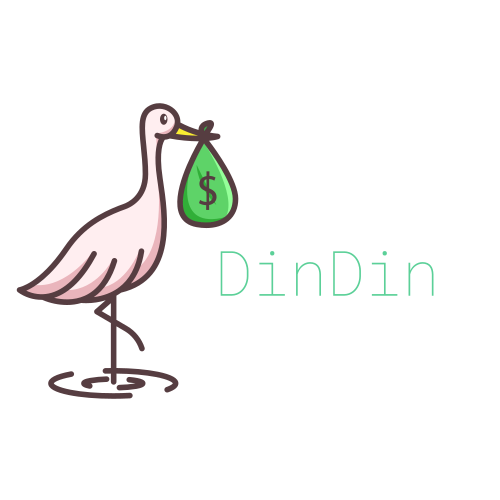

<hr>

<h3 align="center">
    
    <br><br>
    <p align="center">
      <a href="#-sobre">Sobre</a>&nbsp;&nbsp;&nbsp;|&nbsp;&nbsp;&nbsp;
      <a href="#-alunos-integrantes-da-equipe">Alunos Integrantes da Equipe</a>&nbsp;&nbsp;&nbsp;|&nbsp;&nbsp;&nbsp;
      <a href="#-professores-responsáveis">Professores responsáveis</a>&nbsp;&nbsp;&nbsp;|&nbsp;&nbsp;&nbsp;
      <a href="#-tecnologias">Tecnologias</a>&nbsp;&nbsp;&nbsp;|&nbsp;&nbsp;&nbsp;
      <a href="#-instruções-de-utilização">Instruções de utilização</a>&nbsp;&nbsp;&nbsp;|&nbsp;&nbsp;&nbsp;
      <a href="#-licença">Licença</a>
  </p>
</h3>

<hr>

## 🔖 Sobre

A falta de controle de finanças é motivo de estresse em 58,4% das famílias brasileiras. Em um contexto de pandemia, esse problema tem se agravado consideravelmente. Nesse sentido, para não perder o controle financeiro pessoal ou familiar, é necessário alguma estratégia ou ferramenta para gerenciar finanças. Aliando o contexto tecnológico com o problema supracitado, a plataforma <strong style="color: lightgreen"> DinDin </strong> foi desenvolvida para fazer esse papel de ferramenta para acabar com ou atenuar o problema da perda de controle financeiro.

Os problemas financeiros estão presentes diariamente na vida dos brasileiros. Dívidas surgem todos os dias, sejam elas pequenas e repentinas como um lanche vespertino ou grandes e planejadas como uma conta de aluguel. Devido a isso, fica difícil manter o controle sobre quanto se tem, quanto se gastou, e quanto se pode gastar. Nesse contexto, a falta do gerenciamento do dinheiro causa endividamentos, estresse e ocasiona a não realização de sonhos e objetivos pessoais.

Esta é uma aplicação distribuída de controle de finanças pessoais, que possibilita aos seus usuários uma forma mais prática de controlar suas despesas e receitas.

As funcionalidades principais são:
- Permitir ao usuário dividir suas despesas em categorias;
- Permitir ao usuário lançar suas despesas e receitas diárias;
- Permitir ao usuário, junto de outros usuários, lançar despesas e receitas de modo compartilhado.
- Permitir que o usuário controle de onde o dinheiro está saindo ou entrando.


## 👨‍💻 Alunos integrantes da equipe

* [Guilherme Gabriel Silva Pereira](https://github.com/guizombas)
* [Henrique Penna Forte Monteiro](https://github.com/Henrikkee)
* [Lucas Ângelo Oliveira Martins Rocha](https://lucasangelo.com)
* [Victor Boaventura Goes Campos](https://github.com/777-victor)
* [Vinícius Marini Costa E Oliveria](https://github.com/marinisz)

## 👩‍🏫 Professores responsáveis

* Cleiton Silva Tavares
* Pedro Alves De Oliveira

## 🚀 Tecnologias

- Frontend:
  - [Chart.js](https://www.chartjs.org/)
  - [JavaScript](https://www.javascript.com/)
  - [NuxtJs](https://nuxtjs.org/)
  - [NuxtFirebase](https://firebase.nuxtjs.org/service-options/auth/)
  - [SweetAlerts2](https://sweetalert2.github.io/)
  - [VueJs](https://vuejs.org/)
  - [Vuetify](https://vuetifyjs.com/en/)
- Mobile
  - [ChartsFlutter ](https://pub.dev/packages/charts_flutter)
  - [FirebaseAuth](https://pub.dev/packages/firebase_auth)
  - [FontAwesome](https://fontawesome.com/)
  - [Flutter](https://flutter.dev/)
  - [Sqflite](https://pub.dev/packages/sqflite)
- Backend:
  - [ExpressJs](https://expressjs.com/)
  - [JavaScript](https://www.javascript.com/)
  - [JestJs](https://jestjs.io/)
  - [MySQL Server](https://www.mysql.com/)
  - [NodeJs](https://nodejs.org/)
  - [Sequelize](https://sequelize.org/)
- Devops:
  - [Docker](https://www.docker.com/)
  - [Docker Compose](https://docs.docker.com/compose/)
- Cloud:
  - [Azure](https://azure.microsoft.com/) 

## ⤵ Instruções de utilização

Essas instruções vão te levar a uma cópia do projeto rodando em sua máquina local para propósitos de testes e desenvolvimento.

#### Modelo MySql
- [ModeloMySQL.sql](./Artefatos/BancoDeDados/model.mwb)

---

```bash
- git clone https://github.com/ICEI-PUC-Minas-PPLES-TI/plf-es-2022-1-ti5-5104100-DinDin
- cd plf-es-2022-1-ti5-5104100-DinDin
- cd Codigo
```
#### Altere as informações de autenticação do banco
``` bash
$ mv .env.example .env
```
#### Instalar dependências
``` bash
$ npm install
```

#### Rodar a aplicação localmente em dev
``` bash
$ npm run dev
```
#### Ou, rodar a aplicação localmente
``` bash
$ npm run build
$ npm run start
```

## 🔗 Links do projeto

- [Artefatos](Artefatos)
- [Codigo](Codigo)
- [Divulgacao](Divulgacao)
- [Documentacao](Documentacao)

## 📝 Licença

Esse projeto está sob a licença Creative Commons Attribution 4.0 International. Veja o arquivo [LICENSE](LICENSE) para mais detalhes.

---